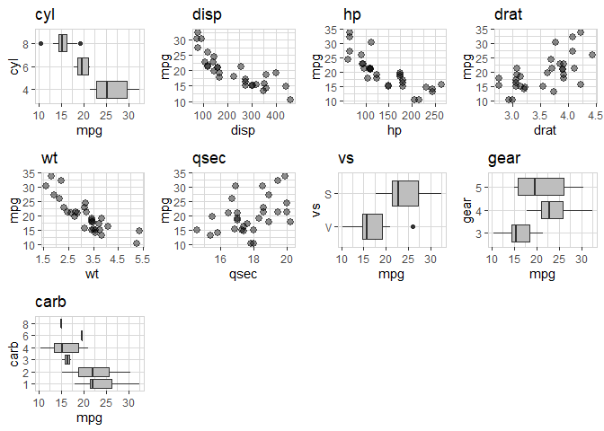
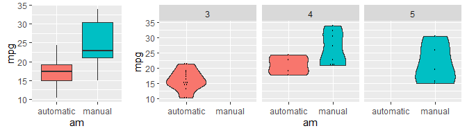
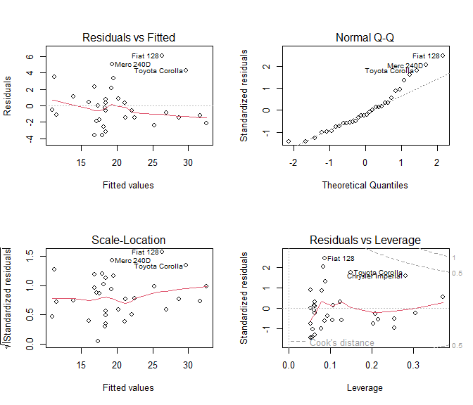
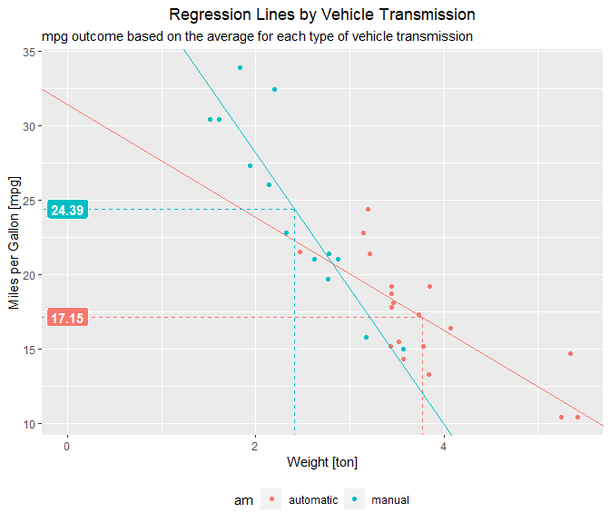

`Course Project` Regression Models
================

-   👨🏻‍💻 Author: Anderson H Uyekita
-   📚 Specialization: <a
    href="https://www.coursera.org/specializations/data-science-foundations-r"
    target="_blank" rel="noopener">Data Science: Foundations using R
    Specialization</a>
-   📖 Course:
    <a href="https://www.coursera.org/learn/regression-models"
    target="_blank" rel="noopener">Regression Models</a>
    -   🧑‍🏫 Instructor: Brian Caffo
-   📆 Week 4
    -   🚦 Start: Tuesday, 05 July 2022
    -   🏁 Finish: Saturday, 09 July 2022
-   🌎 Rpubs: [Interactive
    Document](https://rpubs.com/AndersonUyekita/course-project_regression-models)

------------------------------------------------------------------------

## Brief Analysis about Manual and Automatic Transmissions

## Executive Summary

The data analysis process in this document has identified that manual
vehicles have better performance than automatics concerning miles per
gallon (`mpg`). Furthermore, based on this study’s linear regression
model, the difference has reached 7.24 miles per gallon based on the
average weights of automatic and manual cars (See Figure 4 in APPENDIX
Section A4.), which is a significant number.

## 1. Introduction

The *Motor Trend Car Road Test* has evaluated 32 automobiles varying
from 1973-74 models, and this study comprises fuel consumption,
horsepower, weight, and other aspects. Based on it, the present
publication aims to answer two questions:

1.  “Is an automatic or manual transmission better for MPG?”
2.  “Quantify the MPG difference between automatic and manual
    transmissions.”

## 2. Requeriments and Settings

If you are interested in reproducing this study, please visit the
[Github
repository](https://github.com/AndersonUyekita/regression-models_course-project)
to have access to the raw document.

## 3. Loading Data and EDA

The adjusted data frame has 32 observations with no `NA` values, divided
into 6 (six) numeric variables (no one is standardized or scaled) and 5
(five) categorical variables. For more exploratory details, please, find
them in APPENDIX section A1. For more information about the variables
descriptions, please, see it on the [R Documentation
website](https://stat.ethz.ch/R-manual/R-devel/library/datasets/html/mtcars.html).

Due to Figure 2 in section A2 from APPENDIX, I have tested the
hypothesis that the average consumption from automatic and manual
vehicles is equal. In other words,
,
the p-value is 0.14% which is way less than alpha (5%). For this reason,
the

was **Rejected**, which means the averages of automatic and manual
transmissions are from different populations.

## 4. Model Selection

The model selection approach used for this project is based on the Week
3 videos and the Chapter Multiple variables and model selection from
Regression Models for Data Science in R book.

### 4.1. Base line model

")

The baseline model is the Ordinary Linear Regression, and this model
uses only transmission (`am`) to explain the consumption in miles per
gallon (`mpg`). From the hypothesis tested in Section 3, this baseline
model has identified that manual transmission performs better than
automatic ones. On average, manual transmission yields 24.39 miles per
gallon. On the other hand, automatic transmission yield 17.15 miles per
gallon. The difference is 7.24 miles per gallon.

### 4.2. Analysis of Variance

Using the `anova()` function, it was possible to run several
combinations, reaching the final model using am, wt, and interaction
between am and wt.

")

I have decided to use a simpler model due to the parsimony. The R2
adjusted has reached 81.51%. All p-values of the model are below alpha
(5%).

The linear model coefficients:

<table class="table" style="margin-left: auto; margin-right: auto;">
<thead>
<tr>
<th style="text-align:left;">
</th>
<th style="text-align:right;">
Estimate
</th>
<th style="text-align:right;">
Std. Error
</th>
<th style="text-align:right;">
t value
</th>
<th style="text-align:right;">
Pr(\>\|t\|)
</th>
</tr>
</thead>
<tbody>
<tr>
<td style="text-align:left;">
(Intercept)
</td>
<td style="text-align:right;">
31.416055
</td>
<td style="text-align:right;">
3.0201093
</td>
<td style="text-align:right;">
10.402291
</td>
<td style="text-align:right;">
0.0000000
</td>
</tr>
<tr>
<td style="text-align:left;">
ammanual
</td>
<td style="text-align:right;">
14.878422
</td>
<td style="text-align:right;">
4.2640422
</td>
<td style="text-align:right;">
3.489276
</td>
<td style="text-align:right;">
0.0016210
</td>
</tr>
<tr>
<td style="text-align:left;">
wt
</td>
<td style="text-align:right;">
-3.785907
</td>
<td style="text-align:right;">
0.7856478
</td>
<td style="text-align:right;">
-4.818836
</td>
<td style="text-align:right;">
0.0000455
</td>
</tr>
<tr>
<td style="text-align:left;">
ammanual:wt
</td>
<td style="text-align:right;">
-5.298361
</td>
<td style="text-align:right;">
1.4446993
</td>
<td style="text-align:right;">
-3.667449
</td>
<td style="text-align:right;">
0.0010171
</td>
</tr>
</tbody>
</table>

## 5. Residual Analysis

Due to the low number of observations, below 50, I have used the
Shapiro-Wilk test to ensure the residual’s normality. The p-value
obtained from this test was 8.72%, sufficient to reject the null
hypothesis and proving the residual’s normality.

The residual analysis will be based on Figure 3 in APPENDIX Section A3..
This figure aims to corroborate the following explanations:

-   **Residual vs. Fitted:** The residual bounces around zero, which
    suggests an excellent linear relationship. Also, the residual is a
    homogeneous spread on the plot showing that the variance is
    “constant” in addition, I have identified no outlier.
-   **Normal Q-Q:** Most of the data is around the line, except in the
    top right of the chart. I did not identify any issue related to
    non-normality.
-   **Scale-Location:** There are no patterns in the points, the data
    stay between a fixed band, and the red line is almost constant. From
    those characteristics, the residual is considered homoscedasticity.
-   **Residual vs. Leverage:** No points above the dotted line means
    there is no influential high point.

## 6. Conclusion

Considering the baseline model, the `am` variable can explain 33.85% of
the miles per gallon. However, In the final model, the percentage of
variance explained by the model rises to 81.51% with the inclusion of
two more predictors (`wt` and interaction of `wt` and `am`).

-   **Final model:**

} \implies \beta_0 + \beta_2 \cdot wt = 31.42 -3.79 \cdot wt \\
\text{Manual vehicle (am = 1)} \implies (\beta_0 + \beta_1) + (\beta_2 + \beta_3) \cdot wt = 46.29-9.08 \cdot wt
\end{cases}")

<!-- Adding a Page Break to starting a new APPENDIX page -->
## APPENDIX

### A1. Exploratory Data Analysis

<!-- -->

**Figure 1** – Exploratory Data Visualization

### A2. Miles per Galon (`mpg`) vs Transmission (`am`)

<!-- -->

**Figure 2** – Fuel Consumption divided into Transmission and number of
Gears.

### A3. Residuals

<!-- -->

**Figure 3** – Residuals.

### A4. Regression Lines

<!-- -->

**Figure 4** – On average, a manual car yields 7.24 more miles per
gallon than automatics.
